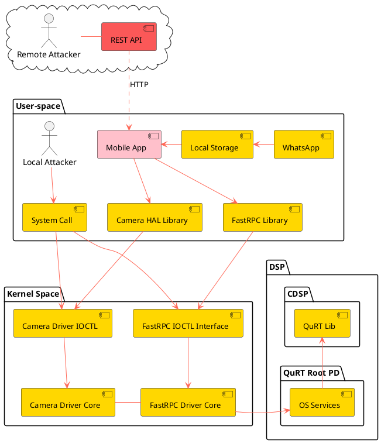

---
aliases:
  - FastRPC Training
  - FastRPC
tags:
  - "#linux-security"
  - "#qpsi/project"
  - "#type/sub-project"
status: done
up: "[[QPSI Security Trainings]]"
created-date: 24-09-2024
summary: The training delivered to FastRPC Team
---

> **Summary**:: 

## Meetings

```dataview
TABLE WITHOUT ID
	file.link as "Session",
	up, created-date, participants, summary, tags
FROM !"Templates"
WHERE icontains(related, this.file.link)
AND icontains(tags, "type/meeting")
SORT file.link DESC
```

## Important Docs

- [FastRPC code review project](https://confluence.qualcomm.com/confluence/display/FDS/FastRPC+driver+security+Home)
- [Training Slides](https://confluence.qualcomm.com/confluence/display/FDS/Training)
- [Surendra Training Slides](https://qualcomm-my.sharepoint.com/:p:/r/personal/suresing_qti_qualcomm_com/_layouts/15/doc2.aspx?sourcedoc=%7B3D900170-B6E0-48A1-BC88-AD6253B32B08%7D&file=Secure_Code_V0.1.pptx&action=edit&mobileredirect=true&DefaultItemOpen=1)
- [FastRPC Team Docs](https://confluence.qualcomm.com/confluence/pages/viewpage.action?pageId=711438594#fastRPC+memory-DifferentdesignsinfastRPC)
- [DSP Fuzzing by Alex T](https://confluence.qualcomm.com/confluence/display/DSPSEC/Fuzzing+the+DSP)
- [Training Feedback Form](https://forms.office.com/Pages/DesignPageV2.aspx?origin=NeoPortalPage&subpage=design&id=ibrpmKHhOE6QB4vavCXeHdj7jN8jKbJBqO8xJfa3OPVUOUlHOEkxT1pFUU1ITEhSTE5SVkhOM0lQTy4u)
- [Qualcomm Internal training - Trust Boundaries](https://360.articulate.com/review/content/fe815d9f-e27f-45bf-8d97-58f339fbe837/review)
---


## Intro Paragraph

Hello everyone,

Thank you for joining us today for this workshop on Secure Coding Practices. I’m excited to kick off what I consider a little experiment aimed at enhancing our security awareness for our product. By doing so, we hope to significantly improve our overall security posture.

This training is not just about learning; it’s about fostering a shared vocabulary between our tech team and the security team. By exposing our tech team to security mental models, we can bridge the communication gap and work more effectively together. Clear communication is essential, and I believe this workshop will lay the groundwork for that.

As I mentioned, this is an empirical approach. Your feedback will be invaluable as we refine our methods and practices. We want to ensure that this initiative meets your needs and helps us all grow in our understanding of secure coding.

Throughout the training, I encourage you to raise questions as early as possible. Addressing concepts early on will create a domino effect, allowing us to build on our knowledge progressively and effectively.

Let’s embark on this journey together, and I look forward to your active participation!

## Project Notes

- Offloading real-time tasks from the CPU to the DSP is a big step toward higher performance, with the sweetener of much lower power consumption.
- Hexagon SDK exposes FastRPC, a remote procedure call framework allowing clients to transparently make remote method invocations between the Qualcomm Snapdragon processor (APPS) and the application DSP (aDSP).
- FastRPC is designed around several features that make offloading tasks as easy as possible:
	- Initiating the remote invocation looks the same as if you called it locally, you provide the function definition via IDL (Interface Description Language).
	- Tools auto-generate interface header and libs to handle parameter passing, cache coherency.
	- For FastRPC calls into dynamic modules the framework loads the aDSP module for you.
	- FastRPC is synchronous. That eliminates the complexity of having the kernel manage state between aDSP and APPS in an asynchronous call
- [[DSP overview]]
---
## Interface Diagram


## Training ToC

1. Basic security knowledge
    1. vulnerability types
    1. how it leads to attacks
2. Understand the attack surface of fastRPC:
    1. inputs and syscalls from userspace(el0->el1 attack)
    2. inputs from DSP(break smmu separation)
    3. shared buffer issues(TOCTOU)
3. Make code multi-thread safe
    1. how to use a shared obj securely
    2. be aware of lock scope
    3. lock vs lockless, which to choose
    4. refcounting and kref, how to use that correctly
4. How to do sanitization
    1. understand what needs to be sanitized
    2. when and how to verify integer overflow
    3. always initialize local variables
    4. Do not set a parameter pointer to be null
5. Fail safe
    1. always check return code
    2. bailout correctly
    3. avoid duplication
6. Use secure API
    1. strcmp vs. strncmp
    2. kref_get vs. kref_get_unless_zero
7. Logic correctness
    1. write unit tests
    2. do not introduce confusion, i.e.,  map->len vs. map->size
    3. explicitly deactivate unused code snippets, i.e, lookup in put_args on pakala
    4. do not let logic mislead
8. Point fix vs. code refactor
    1. Assess risks more fairly
    2. Look at whole picture
    3. Take the responsibility
---

## Notes on Training Conducted

### 22-11-2024

- Explain the concept of Trust in terms of privilege.
- How the Vulnerability score is calculated.
- Software is created and deployed, but in future software design changes or interface contract changes.

## Existing Research

1. [Checkpoint Research](https://research.checkpoint.com/2021/pwn2own-qualcomm-dsp/)
	2. This is an excellent research material by checkpoint research which give good overview as well as in-depth understand of the sub-system.
	3. Any Android application can bring a signed by Qualcomm skeleton library in its assets, extract it to the app’s data directory, add the path to the beginning of the `ADSP_LIBRARY_PATH`_,_ and then open a remote session. The library is successfully loaded on the DSP because its signature is correct.
	4. the possibility to run a very old skel library with a known 1-day vulnerability on the DSP. Even if the updated skeleton library already exists on the device, it is possible to load the old version of this library just by indicating its location in the `ADSP_LIBRARY_PATH` before the path of the original file. In this way, any DSP patch can simply be bypassed by an attacker.
	5. All DSP libraries are signed and cannot be patched
	6. Due to the lack of lists of approved/denied skeleton libraries permitted for the device.
	7. This means that a vulnerability discovered in one of the OEM libraries compromises all Qualcomm-based Android devices.
2. [AI on mobile SoC](https://www.researchgate.net/publication/351169747_AI_Tax_in_Mobile_SoCs_End-to-end_Performance_Analysis_of_Machine_Learning_in_Smartphones)
	1. it has references to FastRPC


## Project Timeline

1. 24-09-2024 - Internal meeting by Surendra
2. 27-09-2024 - handshake meeting