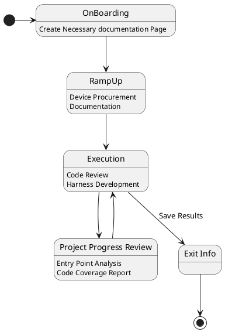

> **Summary**:: 

# Project Planning

## Project On boarding (1 Week)
1. Jira Project Ticket & Confluence Page.
2. Tech Team PoC Info
3. Tech team introduction/engagement criteria
4. Create Project Github Repo

## Ramping-up Requirements (2 Weeks)

2. Build Info & Device Procurement
3. Target Product internal documentation or learning material like Video, Documents
4. Setup and execute unit-test cases on target device

## Execution (8 weeks)
1. Code Review
	1. Entry Point Analysis
	2. Thread Model/Attack Surface
	3. User Case enumeration
	4. Writing Demo/test Application which interacts with the target.
2. Unit-test setup & debugging
	1. What is the code coverage of the unit-test
	2. Setup a debugging environment which execute test case and debug them dynamically.
3. Document entry point and security bugs with weAudit
4. Put following information in github repo
	1. Source Code version info which you are fuzzing for example commit id or meta id
	2. weAudit config file
	3. Pervious two pointer will link weAudit symbols
	4. Any experimental program to test the target
	5. Any fuzzing harness source code you have written.
	6. Instruction to build and use the code in above two points
5. External Presentation Info
	1. Present in QPSI Monthly meeting
	2. Topics to give talk in QIPL Forums
	3. Any open-source contribution we can make.

## Project Progress Review
1. How often should we report/review progress? - once a week(weekly update call)
2. What are KPI/Metrics
	1. Entry Point Analysis - This is for Code Review
	2. Code Coverage - This is for fuzzing
		1. Target: Pakala
			1. Module/Sub-system: camera/fastrpc/graphics
			2. Date: 10-24-2024
			3. Function Coverage:
				1. Previous: 5.83%
				2. Current: 27.78%
			4. Line Coverage:
				1. Previous: 0.24%
				2. Current: 23.50%
3. Blocker Report/Risk update
	1. Is there anything which is blocking your project/progress
	2. This could be updated on daily basis if you encounter something of this sort. Notifying this as early as possible improves our chance of solving it ASAP.
		1. This could be via different channels email/group chats or stand-up call.
		2. This should be a team effort.
	3. Problem with discovering relevant Tech PoC
	4. Hardware/Software issue
	5. People issue

## Exit Information - (1 week)
1. Project hand-over meeting or document sharing, code sharing.
2. Code Coverage Report
3. Entry Point Analysis Report
4. How many CR's were Raised

# Project Template

This goal of this document is to detail out the effort you have put into the project. Using this document either you or someone else should have some advantage of picking up this project from where you left off. Also, next time when someone is doing security assessment of the same component they don't have to spend as much time as you did with the project.

## Objective
> What were you trying to achieve with this project.

## Commands
> Commands which you important or used very frequently while working on the project

```bash
# some of the important command in this project
cd project-dir

```

## Notes
> Random interesting information, observation or anecdotes you observed while working on the projects.
- 

## Challenges & Opportunities
> While working on a project you might encounter challenges which could potentially be solved to further the project.
- 

## Product Docs
> Some of the important internal documents which would you often need to refer very often.

## Build Instruction
> Instruction to clone and build the project from source

```bash
# Cloning instruction

# Building instruction
```

## CR Raised
> Some of the bugs which you created while working on the project

### Bug Tracker

| ID | CR | Rating | Date | Comment |
|---|---|---|---|---|
| 1 | 01 | High | {{date}}| What happened?|

## Thread Model/Attack Surface
> How can we attack the System?

## Meeting Notes
> All the important meeting you have done for the project

## History
> A brief timeline of the project

1. {{date}} - Start project discussion

## Tech Team PoC

| PoC Name | Expertise |
|---|---|
|  |  |


## Related Research Papers or Articles
> Any research paper or articles which address some the issues which we are facing
- External Research
- Existing IRVR Tickets

---

## State Diagram

